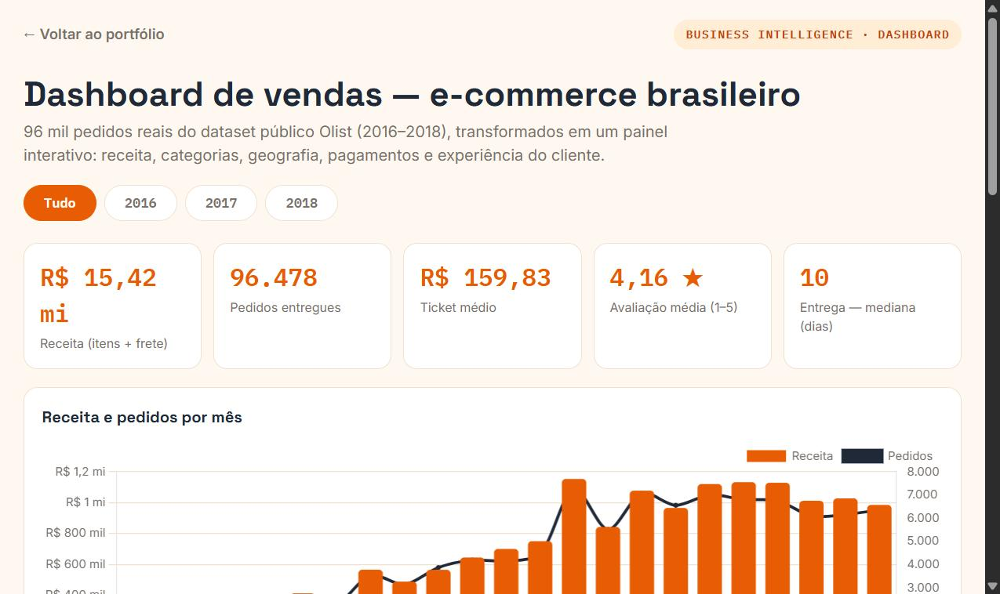

# 🛒 Dashboard de vendas — e-commerce brasileiro (Olist)

Dashboard **interativo** estilo Power BI construído sobre **96.478 pedidos reais** do dataset público Olist (Kaggle, 2016–2018): KPIs, filtros por ano, receita mensal, categorias, estados e formas de pagamento.

🔗 **[Ver o dashboard ao vivo](https://joaotalma.github.io/portfolio/projetos/dashboard-ecommerce/)**



## 📊 Números do painel (pedidos entregues)

| KPI | Valor |
|---|---|
| Receita (itens + frete) | **R$ 15,42 milhões** |
| Pedidos entregues | **96.478** |
| Ticket médio | **R$ 159,83** |
| Avaliação média | **4,16 ★** |
| Entrega (mediana) | **10 dias** |

Destaques: SP concentra **R$ 5,77 mi** de receita (top 1 entre estados); cartão de crédito responde por **R$ 12,1 mi** dos pagamentos; `beleza_saude` é a categoria líder (**R$ 1,41 mi**).

## ⚙️ Como funciona

```
CSVs Olist (9 tabelas) ──> preparar_dados.py (pandas: joins + agregações) ──> dados.json ──> index.html (Chart.js)
```

1. **Modelagem** — joins entre pedidos, itens, produtos, clientes, pagamentos e avaliações (esquema relacional de 9 tabelas)
2. **Agregação** — KPIs por ano, série mensal, top categorias/estados, mix de pagamentos
3. **Visualização** — painel em HTML/Chart.js com filtros interativos, sem backend

> **Transparência:** case demonstrativo com dados públicos. O painel foi feito em tecnologia web para rodar no navegador sem instalar nada — a mesma modelagem e visuais que entrego em **Power BI**.

## ▶️ Como rodar

```bash
# 1. Baixe o dataset em https://www.kaggle.com/datasets/olistbr/brazilian-ecommerce
# 2. Gere os agregados:
pip install pandas
python preparar_dados.py --src /caminho/para/csvs
# 3. Abra index.html (os dados já vão embutidos na página)
```

## 📁 Estrutura

```
dashboard-ecommerce/
├── index.html           # dashboard interativo (Chart.js)
├── preparar_dados.py    # pipeline de agregação (pandas)
└── data/dados.json      # agregados gerados (3,7 KB)
```

## 📊 Fonte dos dados

[Olist Brazilian E-Commerce Public Dataset (Kaggle)](https://www.kaggle.com/datasets/olistbr/brazilian-ecommerce) — ~100 mil pedidos reais anonimizados de marketplace brasileiro, 2016–2018. Licença CC BY-NC-SA 4.0.

---

**João Talma** · Análise de dados, automação em Python, Excel e Power BI
📧 joaotalmaj@gmail.com · [LinkedIn](https://linkedin.com/in/joaotalma) · [WhatsApp](https://wa.me/5511994396290)
