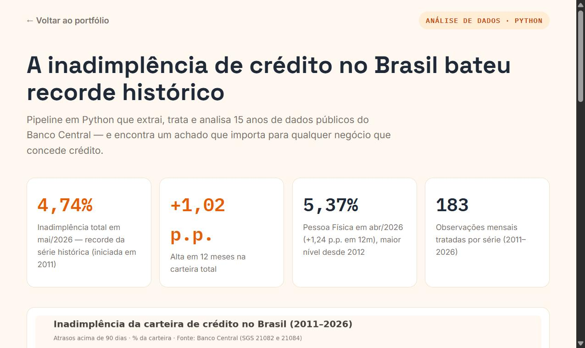
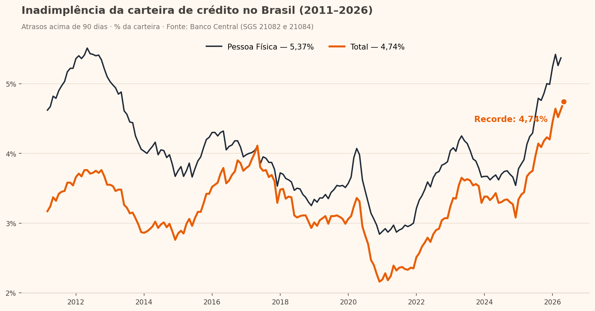

# 📈 Inadimplência de crédito no Brasil (2011–2026)

Pipeline em **Python** que extrai, trata e analisa 15 anos de dados públicos do **Banco Central** (API SGS) — e encontra um achado real: **a inadimplência total bateu recorde histórico em 2026**.



## 🔎 Principais achados

| Indicador | Valor | Referência |
|---|---|---|
| Inadimplência total | **4,74%** (mai/2026) | 🔴 Recorde da série histórica (desde 2011) |
| Variação em 12 meses (total) | **+1,02 p.p.** | mai/2025 → mai/2026 |
| Pessoa Física | **5,37%** (abr/2026) | Maior nível desde 2012 (+1,24 p.p. em 12m) |
| Pico pré-pandemia (total) | 4,11% (mai/2017) | Superado em 2025–2026 |
| Piso histórico (total) | 2,16% (dez/2020) | Auge dos programas emergenciais |



## ⚙️ Como funciona

```
API SGS (Banco Central) ──> pandas (limpeza) ──> estatísticas ──> matplotlib + JSON + página HTML
```

1. **Extração** — download das séries 21082 (Total) e 21084 (Pessoa Física) direto da API pública do BCB, sem chave de acesso
2. **Tratamento** — conversão de tipos e datas, remoção de nulos, snapshot versionado em `data/*.csv`
3. **Análise** — variação 12 meses, picos/pisos históricos, comparativo pré/pós-pandemia
4. **Entrega** — `grafico_inadimplencia.png`, `resumo.json` e página do case (`index.html`)

## ▶️ Como rodar

```bash
pip install pandas matplotlib
python analise.py            # busca dados atualizados na API do BCB
python analise.py --offline  # usa o snapshot local (data/*.csv)
```

## 📁 Estrutura

```
inadimplencia-credito/
├── analise.py                  # pipeline completo (extração → gráfico)
├── index.html                  # página do case
├── grafico_inadimplencia.png   # saída: gráfico
├── resumo.json                 # saída: estatísticas
└── data/                       # snapshot dos dados (CSV)
```

## 📊 Fonte dos dados

[Banco Central do Brasil — Sistema Gerenciador de Séries Temporais (SGS)](https://www3.bcb.gov.br/sgspub/). Séries 21082 e 21084: inadimplência da carteira de crédito (atrasos > 90 dias), % da carteira. Dados 100% públicos e reais.

---

**João Talma** · Análise de dados, automação em Python, Excel e Power BI
📧 joaotalmaj@gmail.com · [LinkedIn](https://linkedin.com/in/joaotalma) · [WhatsApp](https://wa.me/5511994396290)
