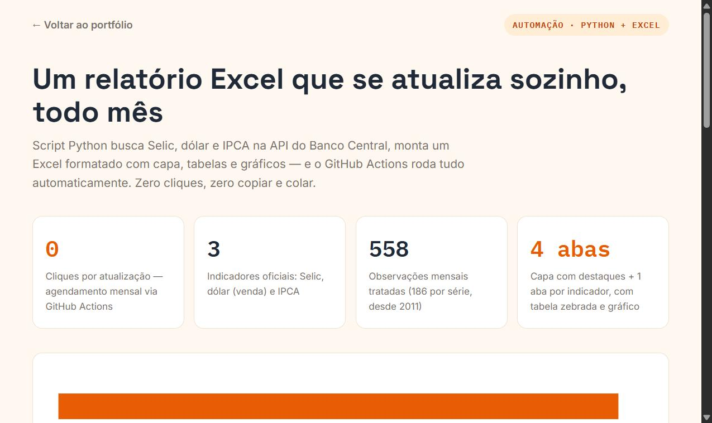
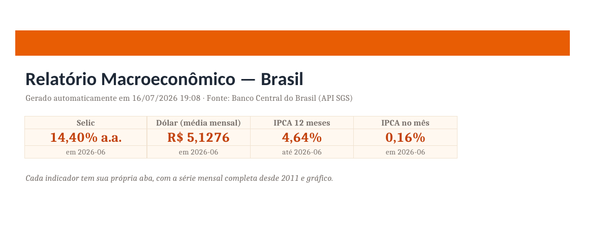

# 🤖 Relatório Excel automatizado — Selic, Dólar e IPCA

Script **Python** que gera (e atualiza sozinho, todo mês, via **GitHub Actions**) um relatório **Excel** formatado com três indicadores oficiais do **Banco Central**. Zero cliques por atualização.



## 📊 O que o Excel contém

| Aba | Conteúdo |
|---|---|
| **Resumo** | Capa com destaques: Selic 14,40% a.a. · Dólar R$ 5,13 · IPCA 4,64% em 12m (jun/2026) |
| **Selic** | Série mensal desde 2011 + gráfico nativo do Excel |
| **Câmbio** | Dólar venda, média mensal, desde 2011 + gráfico |
| **IPCA** | Variação mensal desde 2011 + gráfico |



📥 [Baixar o Excel gerado](relatorio_macro.xlsx)

## ⚙️ Como funciona

```
GitHub Actions (cron mensal) ──> API SGS (BCB) ──> pandas ──> openpyxl ──> relatorio_macro.xlsx ──> commit automático
```

1. **Extração** — séries 4189 (Selic), 3698 (dólar) e 433 (IPCA) da API pública do BCB
2. **Cálculo** — limpeza com pandas + IPCA acumulado 12 meses (composição de fatores)
3. **Excel** — openpyxl monta capa com destaques, tabelas zebradas e gráficos nativos
4. **Automação** — [workflow](../../.github/workflows/atualizar-relatorio.yml) roda todo dia 1º e commita o arquivo atualizado

## ▶️ Como rodar

```bash
pip install pandas openpyxl
python gerar_relatorio.py            # busca dados atualizados na API do BCB
python gerar_relatorio.py --offline  # usa o snapshot local (data/*.csv)
```

## 📁 Estrutura

```
relatorio-macro-excel/
├── gerar_relatorio.py     # pipeline completo (API → Excel)
├── relatorio_macro.xlsx   # saída: relatório formatado
├── index.html             # página do case
└── data/                  # snapshot dos dados (CSV)
```

## 📊 Fonte dos dados

[Banco Central do Brasil — SGS](https://www3.bcb.gov.br/sgspub/): Selic anualizada (4189), dólar venda média mensal (3698), IPCA variação mensal (433). Dados 100% públicos e reais.

---

**João Talma** · Análise de dados, automação em Python, Excel e Power BI
📧 joaotalmaj@gmail.com · [LinkedIn](https://linkedin.com/in/joaotalma) · [WhatsApp](https://wa.me/5511994396290)
